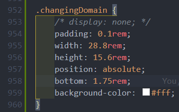
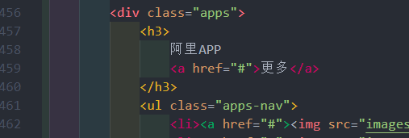
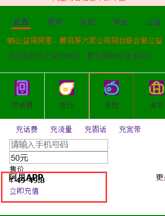
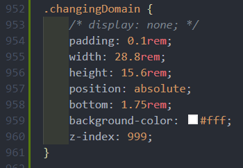
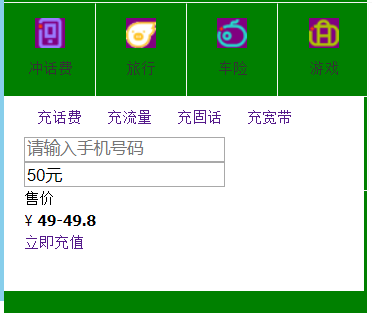

渐变色使用 `linear-gradient`

input 搜索框中 placeholder 的文字使用 `text-indent` 在搜索栏中左右移动位置

`text-indent` 规定文本块中首行文本缩进。
`outline:none` 设置input标签的默认外边线样式。

## 问题汇总

之前vscode利用live server插件在火狐上打开的网页无法显示 favicon.ico，结果之后竟然莫名其妙的可以显示了……

h 标签默认情况下竟然这么高？？？

为白色区域标签提升优先级即可继续覆盖

